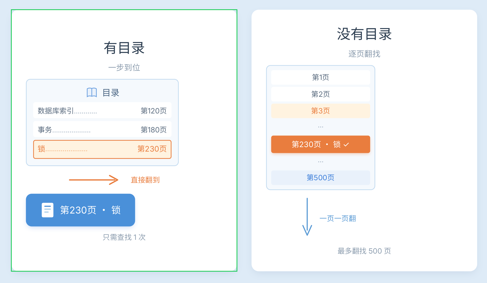

# 4\-索引设计\-1\-认知篇

# 1 索引是什么

索引可以理解成数据库中的**目录，**是数据库设计中一个重要部分，主要解决的就是**如何快速找到数据；**


如现实中的书，如果想找“事务”，可能需要一页一页翻。有目录：可以直接定位到180页。数据库索引也是类似的思想



# 2 索引分类

## 1 主键索引

一个表只能一个，用来保证整条的唯一

```SQL
-- 给表id字段设置为主键
PRIMARY KEY(id)
```

主键的特征是唯一和非空，其中在InnoDB存储引擎中主键索引就是聚簇索引

## 2 唯一索引

用于控制数据不允许重复，非提升查询效率，是为了保证数据唯一

```SQL
-- 在user表的email字段建立唯一，保证email唯一
CREATE UNIQUE INDEX uk_email ON user(email);
```

## 3 普通索引

一个字段建立索引

```SQL
-- 在user表建立name字段的普通索引
CREATE INDEX idx_name ON user(name);

-- 适用于如下查询
where name='张三'
```

## 4 联合索引

多个字段组成一个索引

```SQL
-- 在user表建立name+age字段的联合索引
CREATE INDEX idx_name_age ON user(name,age);
```

## 5 聚簇索引和非聚簇索引

简单来说对于InnoDB存储引擎，聚簇索引就是数据和索引存储在一起（索引\+所有字段），非聚簇索引是二级索引（索引\+非主键id外的其他字段）

### 聚簇索引

Todo 增加一个图

```SQL
id
              10

          /        \

        数据       数据
        
```

叶子节点直接保存完整数据行，因此可以直接通过id找到完整数据

### 非聚簇索引

如在user表中的name字段建立普通索引

```SQL
-- 在name字段建立普通索引，属于非聚簇索引
create index idx_name on user(name);

-- 底层结构如下
  张三         李四
   |           |
 id=10        id=20
```

这样的话，查name等于李四的，就需要两步了

第一步：通过idx\_name索引找到李四对应的id是20

第二步：通过主键索引找到id=20对应的完整数据行，这一步也叫做**回表**

# 3  索引的原理

## 1 为什么索引可以提升查询效率

### 减少了扫描的数据量

没有索引，需要逐条判断，如1000完数据，极端情况就要逐条判断，可能需要扫描好几百万行，复杂度是O\(N\)

有索引，就可以通过索引树查找，复杂度是O\(logN\)


## 2 索引的数据结构

MySQL最常用存储引擎是InnoDB，InnoDB索引主要使用B\+树，B\+树的结构如下


### 1 非叶子节点保存索引

如上述20、80、50是非叶子节点，只是用来导航

### 2 叶子节点保存数据地址

上述10、20、30、80等是叶子节点，是真正存储数据的，如表中name、id、address等字段

### 3 叶子节点有链表连接

上述10 →20 →30 →50 →60 →80 →90组成一个链表，因此范围查询非常快

# 4 总结

索引的主要目的是为了提升查询效率，但同时加入索引牺牲了插入、修改、删除的性能，因此索引不是越多越好，也不是所有字段都需要加索引，索引的使用分为如下场景

## 1 经常作为查询条件的字段

```SQL
select *
from order
where order_no='202608150001';
```

这里订单号查询频繁、唯一性高 ，应该建立索引。

## 2 经常排序字段

```SQL
select *
from user
order by create_time desc;
```

这里如果数据量大，可以增加索引，避免大量排序

## 3 经常关联查询字段

```SQL
select *
from order o
join user u on o.user_id=u.id;
```

这里order表，可以建立索引

## 4 高区分度字段

如手机号，几乎是唯一的，如经常通过手机号查询数据，可以对手机号加索引；

如性别，区分度很低，只有两个值，加了索引仍然返回较多数据，索引价值低


## PS

经常变更的字段不能增加索引，因为字段变更导致索引索引重建，会较大程度降低写入性能

