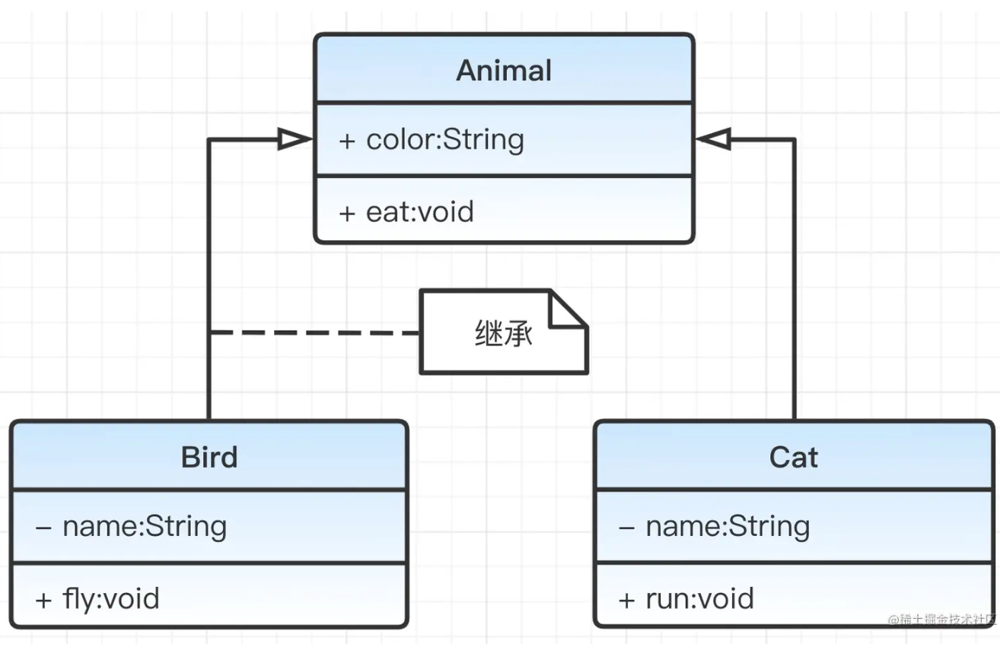

# 1 UML 概述

**UML（Unified Modeling Language，统一建模语言）**：一种图形化建模语言，用于描述软件系统的静态结构和动态行为。

UML 共分为 结构图（静态 ) 和 行为图（动态） 两大类

- 结构图（静态 ) 

  ​	类图、对象图、组件图、部署图

- 行为图（动态）

  ​	用例图、顺序图、协作图、状态图、活动图、时序图

# 2 类图

说明：描述类、属性、方法之间关系

- 类名：图形最上方为类名，如为斜体字则表示是抽象类
- 属性：中间部分
- 方法：最下面部分

说明：属性和方法前面的“+”、“-”和“#”表示访问级别：

- `+`：public
- `-`：private
- `#`：protected

## 1 类与类关系

### 继承

​	实线三角箭头 ；

​	

### 实现

​	虚线三角箭头

### 聚合

​	空心菱形（弱关系）

### 组合

​	实心菱形（强关系）

2

3

4 

